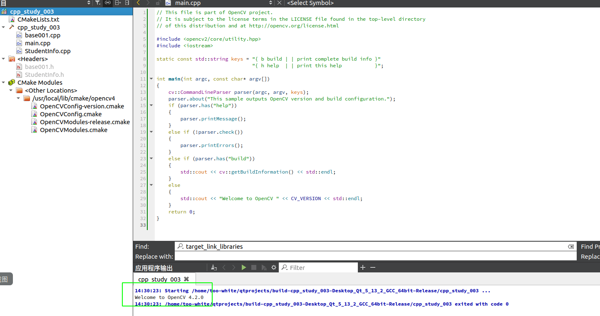

# 摘要

本文主要记录Ubuntu安装Opencv4以及qt开发环境配置问题

-  安装opencv
-  qt中配置opencv开发环境

> 登录账号：porterpan@163.com，Smriti***

- [x] Edit By Porter, 积水成渊,蛟龙生焉。

<!-- more -->

## 安装过程

### 安装Opencv

首先下载opencv-4.4.0.zip文件，执行如下的步骤实现Opencv的安装

```bash
tar -xyz opencv-4.4.0.zip && cd opencv-4.4.0
mkdir build && cd build
sudo cmake -D CMAKE_BUILD_TYPE=RELEASE -D CMAKE_INSTALL_PREFIX=/usr/local ..
sudo make -j4
sudo make install
```

CMAKE_BUILD_TYPE 是编译的模式参数，“CMAKE_INSTALL_PREFIX”是安装路径参数。第一行命令的最后一定不要忘记有一个“..”指令，其含义是告诉编译器将要编译的文件是来自上一层文件夹中的CMakeList.txt文件。

### opencv环境配置

```bash
sudo gedit /etc/ld.so.conf.d/opencv.conf
/usr/local/lib #在文件中写入
sudo ldconfig
sudo gedit /etc/bash.bashrc
PKG_CONFIG_PATH=$PKG_CONFIG_PATH:/usr/local/lib/pkgconfig
export PKG_CONFIG_PATH
#接着
source /etc/bash.bashrc
sudo updatedb
```

### opencv环境验证(CMake)

```cmake
cmake_minimum_required(VERSION 3.5)
SET(SOURCE_FILES
main.cpp StudentInfo.cpp base001.cpp
)
project(cpp_study_003 LANGUAGES CXX)


## 引入OpenCV end

set(CMAKE_CXX_STANDARD 14)
set(CMAKE_CXX_STANDARD_REQUIRED ON)

## 引入OpenCV begin
find_package(OpenCV REQUIRED) # 寻找opencv的安装路径
message(STATUS "OpenCV 类库状态")
message(STATUS "    版本号: ${OpenCV_VERSION}")
message(STATUS "    库: ${OpenCV_LIBS}")
message(STATUS "    路径: ${OpenCV_INCLUDE_DIRS}")
# Add OpenCV headers location to your include paths
include_directories(${OpenCV_INCLUDE_DIRS})
add_executable(cpp_study_003 ${SOURCE_FILES})
# Link your application with OpenCV libraries
##注意 cpp_study_003是我的项目名称，你需要改成自己的项目名称
## 还有，target_link_libraries要用在add_executable后面
target_link_libraries(cpp_study_003 ${OpenCV_LIBS})
```

set(CMAKE_CXX_STANDARD 14)，意思是cmake用的c++14来进行编译。

然后再qt工程中写入代码

```cpp
// This file is part of OpenCV project.
// It is subject to the license terms in the LICENSE file found in the top-level directory
// of this distribution and at http://opencv.org/license.html

#include <opencv2/core/utility.hpp>
#include <iostream>

static const std::string keys = "{ b build | | print complete build info }"
                                "{ h help  | | print this help           }";

int main(int argc, const char* argv[])
{
    cv::CommandLineParser parser(argc, argv, keys);
    parser.about("This sample outputs OpenCV version and build configuration.");
    if (parser.has("help"))
    {
        parser.printMessage();
    }
    else if (!parser.check())
    {
        parser.printErrors();
    }
    else if (parser.has("build"))
    {
        std::cout << cv::getBuildInformation() << std::endl;
    }
    else
    {
        std::cout << "Welcome to OpenCV " << CV_VERSION << std::endl;
    }
    return 0;
}
```


### opencv环境验证(Qmake)

新建一个Qmake编译的工程文件，然后再.pro文件中写入如下的配置命令

```bash
TEMPLATE = app
CONFIG += console c++11
CONFIG -= app_bundle
CONFIG -= qt

SOURCES += main.cpp

INCLUDEPATH += /usr/local/include/opencv4 \
                /usr/local/include/opencv2

LIBS += /usr/local/lib/lib*
```

在main.cpp文件夹中输入如下的测试代码

```c++
#include <opencv2/opencv.hpp>

using namespace cv;

int main()
{
    Mat img = imread("/home/porter/WorkSpace/C Plus Project/image/CT-EZ-1.jpeg");
    imshow("image",img);
    waitKey(0);
    return 0;
}
```

得到你要显示的代码，如果能正常运行则表示环境配置成功。