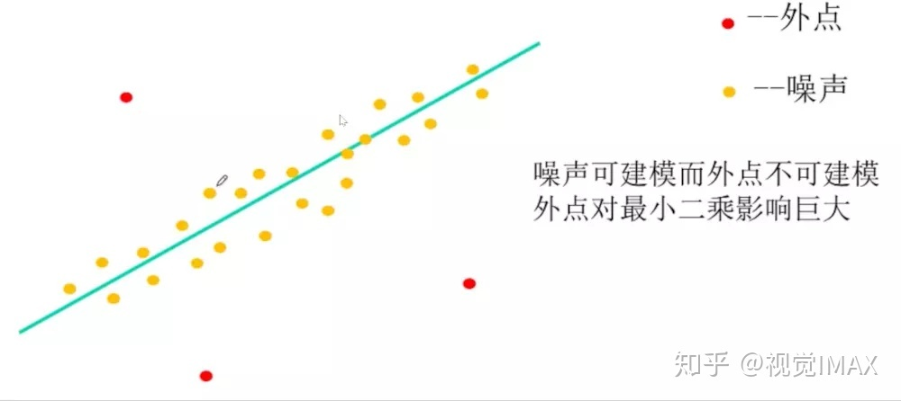
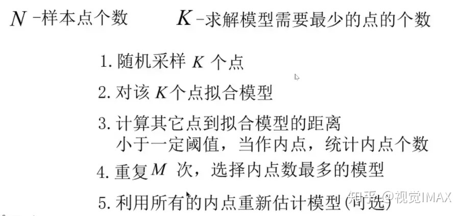
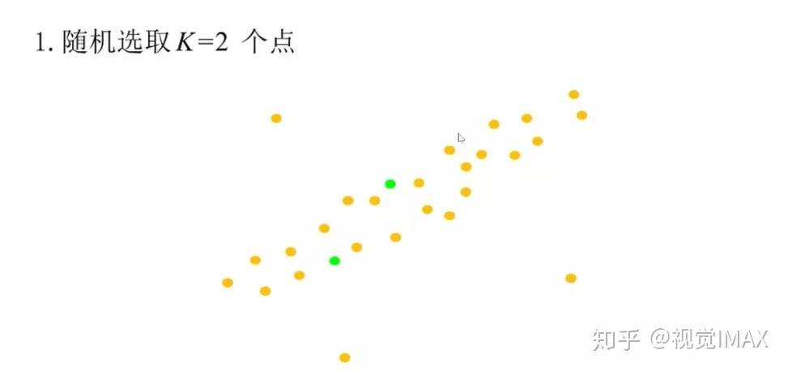
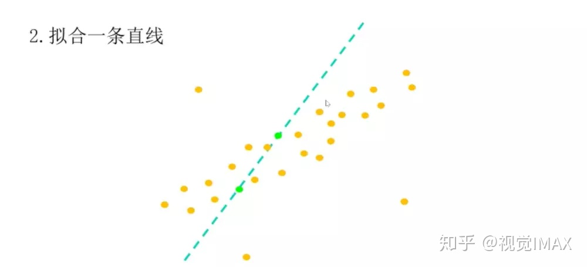
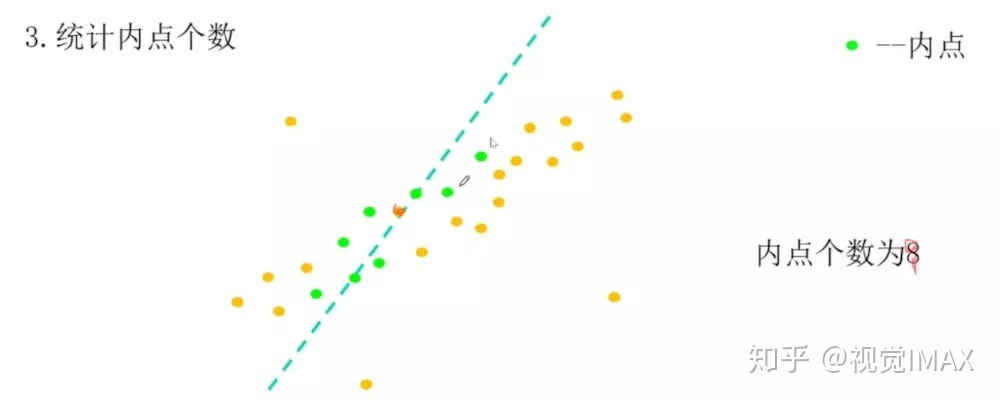
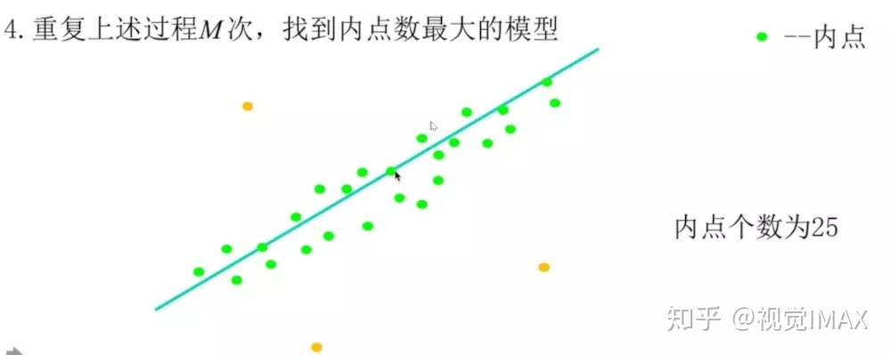
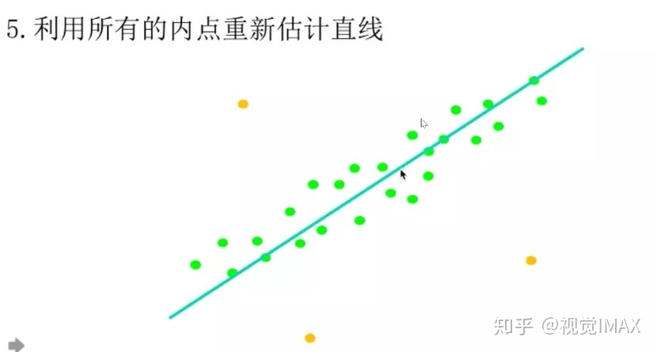
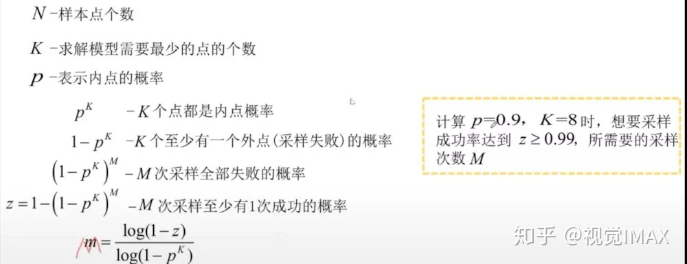
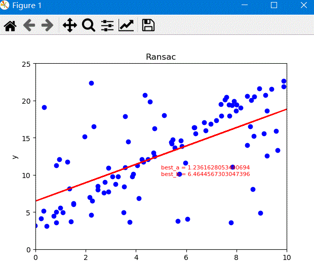

# 摘要

RANSAC(RAndom SAmple Consensus,随机采样一致)

ransac algorithm，在可能存在无匹配的情况下，我们更倾向于使用ransac（random sample concensus, RANSAC）来求解，而不是最小二乘法。RANSAC 算法是一种通用的做法，适用于很多带错误数据的情况，可以处理带来错误匹配的数据。

《视觉slam十四讲》--7.4节。

简介

RANSAC(RAndom SAmple Consensus,随机采样一致)算法是从一组含有“外点”(outliers)的数据中正确估计数学模型参数的迭代算法。“外点”一般指的的数据中的噪声，比如说匹配中的误匹配和估计曲线中的离群点。所以，RANSAC也是一种“外点”检测算法。RANSAC算法是一种不确定算法，它只能在一种概率下产生结果，并且这个概率会随着迭代次数的增加而加大（之后会解释为什么这个算法是这样的）。RANSAC算最早是由Fischler和Bolles在SRI上提出用来解决LDP(Location Determination Proble)问题的[ $^{[1.]}$ ](https://zhuanlan.zhihu.com/p/62238520)。



<!-- more -->

# 算法思路

RANSAC通过反复选择数据中的一组随机子集来达成目标。被选取的子集被假设为局内点，并用下述方法进行验证：

1. 有一个模型适用于假设的局内点，即所有的未知参数都能从假设的局内点计算得出。
2. 用1中得到的模型去测试所有的其它数据，如果某个点适用于估计的模型，认为它也是局内点。
3. 如果有足够多的点被归类为假设的局内点，那么估计的模型就足够合理。
4. 然后，用所有假设的局内点去重新估计模型，因为它仅仅被初始的假设局内点估计过。
5. 最后，通过估计局内点与模型的错误率来评估模型。



## 1.1 举例， 使用RANSAC——拟合直线[ $^{[2.]}$ ](https://zhuanlan.zhihu.com/p/45532306)













# opencv 中的ransac 算法

关于OpenCV中使用到RANSAC的相关函数

```c++
1. solvePnPRansac
2. findFundamentalMat
```

# 迭代次数推导 [ $^{[3.]}$ ](https://blog.csdn.net/YMWM_/article/details/121497645)

已知一组数据点中既包含内点又包含外点，其中内点占的比例为 p，且计算模型参数至少需要k kk个数据点，要求经过RANSAC算法之后有概率q qq的把握以上排除所有外点，那么迭代次数n nn至少应该设定为多少？

解答：

随机选取k个点，这k个点都为内点的概率为 $p^{k}$ ，那么这k个点中至少有一个为外点的概率为 $1-p^{k}$。

n 次迭代，每次选择到的数据点都存在外点的概率为 $(1-p^{k})^{n}$ 。
 ，则至少有一次选择到的都是内点的概率为 $1-(1-p^{k})^{n}$ ，依据题意，**此概率要大于等于q**，有，

$1-(1-p^{k})^{n} \ge q$

$1-q \ge (1-p^{k})^{n}$

两边取对数有，

$ln(1-q) \ge n.ln(1-p^{k})$

两边同时除以 $ln(1-p^{k})$ 可得（注意两边除以一个负数，不等式要变号），

$n \ge \frac{ln(1-q)}{ln(1-p^{k})}$

n向上取整数即为迭代次数。

# code demo

```python
from typing import Sized
import numpy as np
import matplotlib.pyplot as plt
import random
import math

SIZE = 50
a = 2
b = 3


X = np.linspace(0,10,SIZE)
Y = a*X+b

random_x = []
random_y = []

for i in range(SIZE):
    random_x.append(X[i]+random.uniform(-0.5,0.5))
    random_y.append(Y[i]+random.uniform(-0.3,0.3))

for i in range(SIZE):
    random_x.append(random.uniform(0,10))
    random_y.append(random.uniform(3,23))

fig =plt.figure()
ax1 = fig.add_subplot(1,1,1)


# 使用ransac迭代
iter_num = 1000
eplison = 0.25

best_a = 0          # x
best_b = 0          # b
best_inliers_num = 0     # 内点数目

p_our = 0.9         # 自定义的概率，k次迭代中至少有一次全是内点的概率
# for i in range(iter_num):
i = 0
while(i<iter_num):
    print("--- iter_num:{}/{}---".format(i,iter_num))
    # 1 得到模型估计点
    indx1,indx2 = random.sample(range(len(random_x)),2)
    point1_x = random_x[indx1]
    point1_y = random_y[indx1]
    point2_x = random_x[indx2]
    point2_y = random_y[indx2]

    # 2 得到模型参数
    a = (point2_y-point1_y)/(point2_x - point1_x)
    b = point2_y - a*point2_x

    # 3 判断模型成绩（统计内点数量）
    cur_inliner_num = 0         # 当前模型的内点数量
    err = 0                     # 统计每一次的平均误差
    for j in range(len(random_x)):

        # 计算距离
        cur_point_x = random_x[j]
        cur_point_y = random_y[j]
        cur_dis = abs(a*cur_point_x - cur_point_y + b)/math.sqrt( a*a+1 )
        err+=cur_dis*cur_dis
        if(cur_dis<=eplison):
            cur_inliner_num+=1
    err/=len(random_x)
    print("iter: {}, cur_inliner_num:{}, best_inliner_num:{}, err:{}".format(i,cur_inliner_num,best_inliers_num,err))

    i+=1
    
    # 如果当前模型的内点数量大于最好的模型的内点数量，更新a,b
    if(cur_inliner_num>best_inliers_num):
        
        P = cur_inliner_num/(2*SIZE)        # 计算内点概率P（假设开始不知道）
        best_inliers_num = cur_inliner_num  # 更新最优内点的数量
        best_a = a                          # 更新模型参数
        best_b = b
        iter_num = math.log(1-p_our)/math.log(1-pow(P,2))       # 更新迭代次数
        i=0                 # 当前迭代置为0
        print("[update] iter:{}, a:{}, b:{}, P:{}, best_inliner_num:{}, iter_num:{}".format(i,best_a,best_b,P,best_inliers_num,iter_num))
    
    if(best_inliers_num>SIZE-10):
        print("iter[{}] converge")
        break
    
    ax1.cla()
    ax1.set_title("Ransac")
    ax1.set_xlabel("x")
    ax1.set_ylabel("y")

    # 设置x,y轴的范围 0-10，0-25
    plt.xlim((0, 10))
    plt.ylim((0, 25))
    ax1.scatter(random_x,random_y,color='b')

    Y_pred = best_a*np.asarray(random_x)+best_b
    ax1.plot(random_x,Y_pred,color='r')

    text = "best_a = " + str(best_a) + "\nbest_b = " + str(best_b)
    plt.text(5,10,text,fontdict={'size':8, 'color':'r'})
    plt.pause(0.1)

```



# 参考文献

[1. RANSAC算法详解(附Python拟合直线模型代码)](https://zhuanlan.zhihu.com/p/62238520)

[2. 计算机视觉基本原理——RANSAC](https://zhuanlan.zhihu.com/p/45532306)

[3. RANSAC算法中迭代次数的计算](https://blog.csdn.net/YMWM_/article/details/121497645)

[4. RANSAC算法基本原理+代码实现](https://zhuanlan.zhihu.com/p/373024113)
