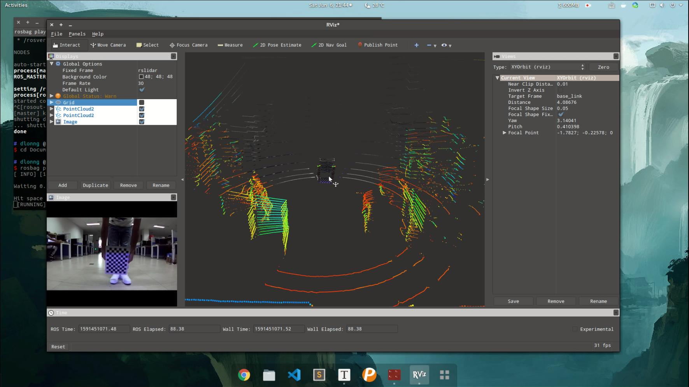

# 摘要

未完待续

- [x] Edit By Porter, 积水成渊,蛟龙生焉。 

<!-- more -->

https://blog.csdn.net/qq_32761549/article/details/108999110

## 1. 单目相机和激光雷达联合标定介绍

- [livox_camera_lidar_calibration_modified](https://github.com/Shelfcol/livox_camera_lidar_calibration_modified/blob/master/doc_resources/README_cn.md)

livox_camera_lidar_calibration_modified 方案提供了一个手动校准Livox雷达和相机之间外参的方法，已经在Mid-40，Horizon和Tele-15上进行了验证。其中包含了计算相机内参，获得标定数据，优化计算外参和雷达相机融合应用相关的代码。本方案中使用了标定板角点作为标定目标物，由于Livox雷达非重复性扫描的特点，点云的密度较大，比较易于找到雷达点云中角点的准确位置。相机雷达的标定和融合也可以得到不错的结果。

- [Autoware 标定工具 Calibration Tool Kit 联合标定](https://www.freesion.com/article/75521014295/)

- 