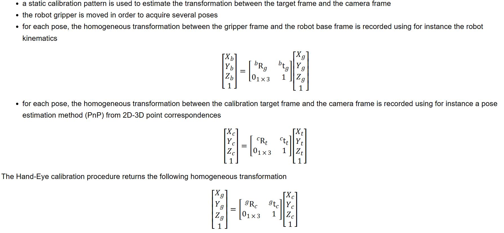
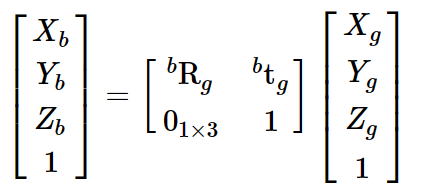
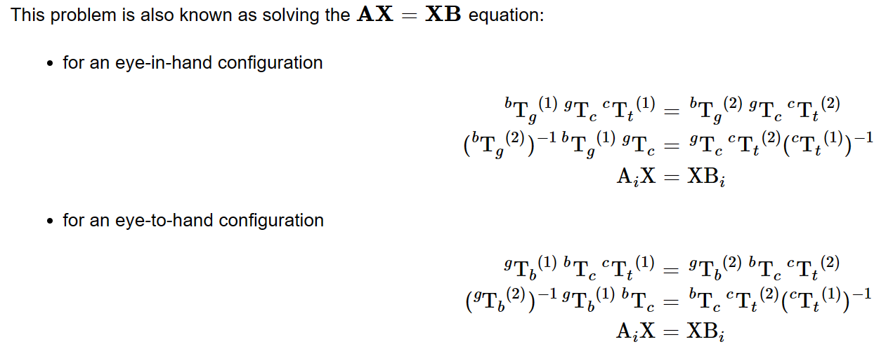
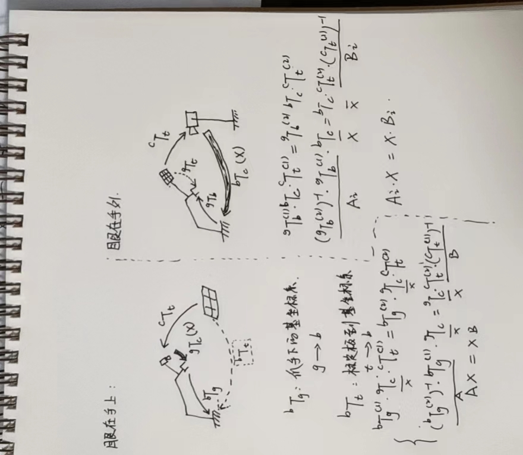
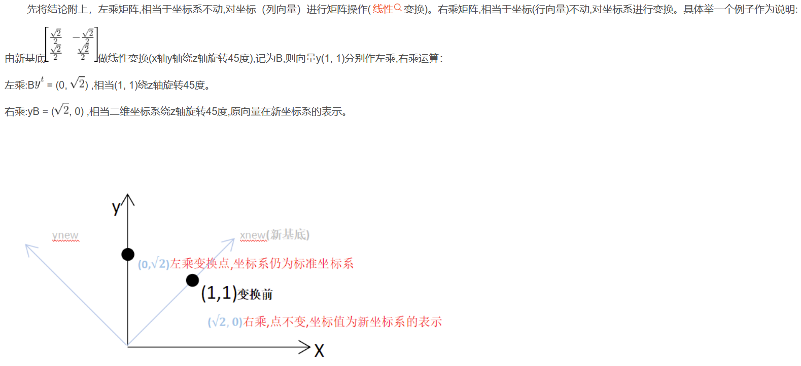

# 摘要

手眼标定一般用于机械臂和相机之间的坐标变换关系。手眼标定一般有两种情形，一种是眼在手上的手眼标定，相机固定在机械臂上，随机械臂一起移动；一种是眼在手外的手眼标定方法，相机固定在机械臂外，相机固定不和机械臂一起动。

眼在手上主要标定机械臂末端end到相机cam之间的转移矩阵；眼在手外主要标定相机和机械臂基座之间的转移矩阵。

- [x] Edit By Porter, 静以修生，俭以养德，非淡泊无以明志，非宁静无以致远。 

<!-- more -->

# 1. 手眼标定方法介绍

## 1.1 opencv 手眼标定方法

目前可以实现手眼标定的方法有很多，比较常见的是[opencv 的 calibrateHandEye()](https://docs.opencv.org/4.5.1/d9/d0c/group__calib3d.html#gaebfc1c9f7434196a374c382abf43439b)

$_{}^{b}{T}_g$ 表示 $g\rightarrow b$ , 机械臂工具坐标到机械臂基座标的变换矩阵，这部分可以从示教器中读取，一般为3x3的旋转矩阵或者3x1的旋转向量，以及3x1的平移向量。

$_{}^{c}{T}_t$ 表示 $t \rightarrow c$ , 棋盘格坐标系到相机坐标系的变换矩阵。这一部分需要相机识别棋盘格得到。

$_{}^{g}{T}_c$ 表示 $c \rightarrow g$ , 相机坐标系到机械臂工具坐标的变换矩阵。这一部分是我们求解 $AX=XB$ 的待求解变量X。

标定过程(眼在手上)如下

- 固定标定板，用来估计目标位置和相机坐标的关系
- 移动机械臂获取多组姿态
- 对每组姿态，使用机器人运动学记录机器人工具到基座之间的齐次变换关系
  
注意：标定过程是左乘，基座标没有变，和求DH参数的右乘是有区别的。

---

即，基座标 = [工具坐标下的基座标变换矩阵]*工具坐标；

$$
\begin{bmatrix} X_c\\ Y_c\\ Z_c\\ 1 \end{bmatrix} = \begin{bmatrix} _{}^{c}\textrm{R}_t & _{}^{c}\textrm{t}_t \\ 0_{1 \times 3} & 1 \end{bmatrix} \begin{bmatrix} X_t\\ Y_t\\ Z_t\\ 1 \end{bmatrix}
$$

即，相机坐标=[标定板下的相机坐标旋转矩阵]*标定板上的坐标

$$
\begin{bmatrix} X_g\\ Y_g\\ Z_g\\ 1 \end{bmatrix} = \begin{bmatrix} _{}^{g}\textrm{R}_c & _{}^{g}\textrm{t}_c \\ 0_{1 \times 3} & 1 \end{bmatrix} \begin{bmatrix} X_c\\ Y_c\\ Z_c\\ 1 \end{bmatrix}
$$

即，机械臂工具坐标=[带求解的相机下的机械臂工具坐标矩阵]*相机坐标

---

这个问题就是求解AX=XB；

对于眼在手上的标定AX=XB求解过程

> 参考 opencv calibrateHandEye() 函数的实现方法。

## 1.2 MoveIt 中的手眼标定

MoveIt Calibration软件包进行手眼标定

# 2. 手眼标定原理

这里有第三方实现的 [手眼标定库](https://gitee.com/ohhuo/handeye-calib/tree/master)

<iframe height=498 width=100%  src="//player.bilibili.com/player.html?aid=219170162&bvid=BV1r8411Y75V&cid=866586368&page=1" scrolling="no" border="0" frameborder="no" framespacing="0" allowfullscreen="true"> </iframe>

# 3. 左乘和右乘的区别

[变换矩阵的左乘与右乘区别](https://blog.csdn.net/fennudecainiao/article/details/122034178)

左乘矩阵,相当于坐标系不动,对坐标（列向量）进行矩阵操作(线性变换)。右乘矩阵,相当于坐标(行向量)不动,对坐标系进行变换。

