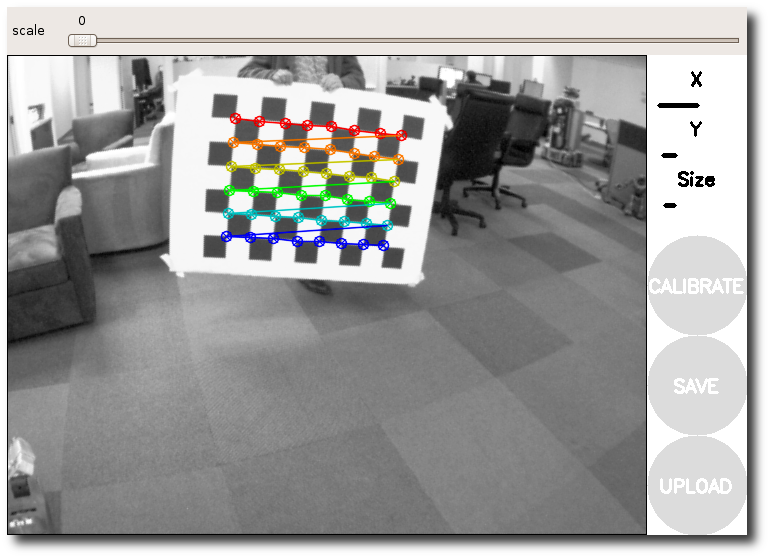
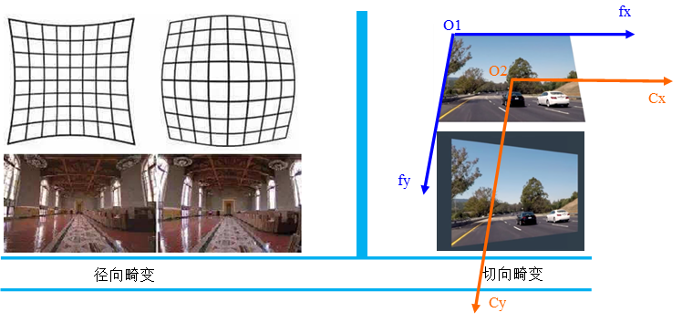

# 摘要

视觉任务中，相机取图往往都会因为相机畸变问题，导致图像发生畸变。图像的畸变会导致视觉进行目标定位产生位置的识别偏差，如何解决这一偏差问题，就是相机内参标定需要解决的问题。


- [x] Edit By Porter, 积水成渊,蛟龙生焉。 

<!-- more -->

# 1. 单目相机内参标定方法第三方工具介绍

目前可以实现相机标定的方法有很多，比如常见的matlab自带相机标定工具箱，可以实现单目相机标定例如 

- [Matlab工具箱标定单目相机](https://blog.csdn.net/weixin_43159148/article/details/97760135)
- 


- [Gyroflow-Rust 可视化相机标定工具](https://zhuanlan.zhihu.com/p/601435997)
- 


- [GML Camera Calibration Toolbox](https://zhuanlan.zhihu.com/p/345583774)
- 


-[VisionMaster](https://blog.csdn.net/HuangGong2022/article/details/127528001)


[halcon 相机内参标定](https://blog.csdn.net/wxy98520/article/details/124874495)


- [autoware](https://github.com/XidianLemon/calibration_camera_lidar)


-[ros 自带的标定功能包](http://wiki.ros.org/camera_calibration/Tutorials/MonocularCalibration)




# 2. 单目相机标定原理介绍

## 2.1 标定的内容


- 相机内参标定目的是消除相机物理结构导致的图像畸变。 
- 由透镜形状引起的畸变称为径向畸变，径向畸变主要分为桶形畸变和枕型畸变。 
- 在相机的组装过程中由于不能使透镜严格和成像平面平行，会引入切向畸变。



畸变图


## 2.2 标定中的基本参数解释

- FocallLength: [fx,fy] 表示在图像坐标x、y轴上的焦距。$fx=F*Sx,fy=F*Sy$, F是世界坐标的焦距（Realsense焦距为），Sx表示在x,y轴上一个像素代表世界坐标下的大小。
- PrintLength：[Cx,Cy] 像素中心


- Homography matrix，单应性矩阵
单应性矩阵主要是指平面单应性矩阵，在三轴坐标中XYZ，Z=1这个有点类似于三维的齐次坐标。单应性矩阵主要用来解决两个问题：

$\rightarrow$ 一是表述真实世界中一个平面与对应它图像的透视变换

$\rightarrow$	二是从通过透视变换实现图像从一种视图变换到另外一种视图

$\rightarrow$ 两个不同视角的图像上的点对的homogeneous coordinate（H）可以用一个射影变换（projective transformation）表述，即：$x1 =H*x2$

- 单应性矩阵：在计算机视觉中被定义为一个平面到另一个平面的投影映射。

## 2.3 成像坐标系统


图像坐标和像素坐标的区别


**世界坐标：** 物体所处的真实环境，相对人眼所处的世界坐标。可以用来衡量相机和物体的真实世界关系，Z轴一般是垂直地表向上。(这个世界坐标一般就是机械臂的坐标，原点在机械臂原点)

**相机坐标：** 感光单元上的坐标，坐标原点就是感光器件圆心，Z轴为镜头光轴即上图的Zc。

**像素坐标系：** 像素坐标是上图红色的坐标Ouv，反映了相机CCD/CMOS芯片中像素的排列情况，其中像素坐标中心点位(U0，V0)。

**图像坐标：** 像素坐标系不利于坐标变换，所以需要转为图像坐标，图像坐标为Oxy，坐标轴原点为(U0,V0）。

标定原理(世界坐标转到像素坐标的关系)：相机坐标到世界坐标的关系；图像坐标到相机坐标；像素坐标到图像坐标的关系；

```code
[Zc,尺度]*像素坐标 = [图像坐标到像素坐标的关系]*[相机坐标到图像坐标关系]*[世界坐标到相机坐标关系]*[世界坐标]
```

而四大坐标系，包括世界坐标系、相机坐标系、图像坐标系、像素坐标系，它们之间的转换关系如下：


最终，从理想的相机模型，从世界坐标系到像素坐标系的转换关系：


但由于制造原因，使得成像过程（从相机坐标系到图像坐标系转换过程中）存在着畸变，主要有两类，径向畸变和切向畸变，它们可以通过以下公式进行修正：


## 2.4 像素坐标用图像坐标表示（uv $\rightarrow$ xy）


dx和dy表示：x方向和y方向的一个像素分别占多少个（可是小数）长度单位。

## 2.5 相机坐标转换为图像坐标|棋盘格所有方格图像坐标z设置为一个常数，用相机坐标表示（相机下的棋盘格位置转换为图像坐标）


 从相机坐标系到图像坐标系经过了投影变换，图像坐标为二维坐标，没有Z轴分量，成像平面距光心的距离为焦距f,这边有个要注意的是，从相机坐标系到图像坐标系的变化会引入一个尺度因子，这个尺度因子和 Zc 相关。

## 2.6 世界坐标转换为相机坐标

每张棋盘格都可以计算得到棋盘格在相机坐标系下的一个pose，6D姿态，即需要将棋盘格的世界坐标转换为相机坐标，转换如下


## 2.7 相机内参标定原理（世界坐标转换到像素坐标的关系，不考虑畸变）


得到fx，fy,u0,v0。

注意内参标定中基座标不变，左乘的关系。


## 2.8 从理想图像坐标系到实际图像坐标系（考虑畸变）

物体通过镜头投影到平面上时，受制于镜头的工艺问题，成像会产生畸变，主要就是我们上文提的径向畸变和切向畸变。

### 径向畸变

径向畸变是最常见的畸变，沿着成像镜头半径方向凹凸的坍缩和膨胀，即枕形或桶形。产生原因是光线在原理透镜中心的地方比靠近中心的地方更加弯曲。

 成像仪光轴中心的畸变为0，沿着镜头半径方向向边缘移动，畸变越来越严重。畸变的数学模型可以用主点（principle point）周围的泰勒级数展开式的前几项进行描述，通常使用前两项，即k1和k2，对于畸变很大的镜头，如鱼眼镜头，可以增加使用第三项k3来进行描述。

$r^{2}=x_{p}^{2}+y_{p}^{2}$

实际情况中常用$r=0$处的泰勒级数展开的前几项来近似描述径向畸变。，成像仪上某点根据其在径向方向上的分布位置，矫正径向畸变前后的坐标关系为：

$$
x_{coor} =x_{p}(1+k_{1}r^{2}+k_{2}r^{4}+k_{3}r^{6})   \\\\
y_{coor}=y_{p}(1+k_{1}r^{2}+k_{2}r^{4}+k_{3}r^{6})
$$

由此可知对于径向畸变，我们有3个畸变参数需要求解。

等式右边的 $(x_{p}, y_{p})$ 为得到的图像中的理想点，但是存在畸变，于是把其带入等式左边，经过径向和切向变换后，得到右边的畸变校正后的实际点坐标 $(x_{coor}, y_{coor})$ .

### 切向畸变

切向畸变是由于透镜本身与相机传感器平面（成像平面）或图像平面不平行而产生的，这种情况多是由于透镜被粘贴到镜头模组上的安装偏差导致。

切向畸变需要两个额外的畸变参数来描述，矫正前后的坐标关系为：

$$
x_{coor} =x_{p}+[2p_{1}x_{p}y_{p}+p_{2}(r^{2}+2x_{p}^{2})]  
$$

且

$$
y_{coor}=y_{p}+[p_{1}(r^{2}+2y_{p}^{2})+2p_{2}x_{p}y_{p}]  
$$

由此可知对于切向畸变，我们有2个畸变参数需要求解。

综上，我们一共需要5个畸变参数（k1、k2、k3、p1、p2 ）来描述透镜畸变。

## 2.9 总结

单目相机标定可以得到相机的内参，fx,fy,u0,v0. 相机的外参，和每张棋盘格的R,T。 相机的畸变参数，k1,k2,k3, p1,p2.

单目相机标定，就是标定相机的内参、畸变和外参(相机相对于每张棋盘格的像素坐标转棋盘格上的坐标转换关系)。

单目相机的外参标定，就是标定相机和标定物之间的关系，比如棋盘格上标定物，每个棋盘格有9*6=54个坐标定，假设棋盘格左上角为坐标原点，则通过这一张棋盘格照片，可以标定出相机外参(棋盘格上的世界坐标和相机像素坐标之间的关系)。


# 3. 参考文献

[matlab标定，opencv使用标定结果案例](https://blog.csdn.net/liangjiubujiu/article/details/96305231)

[一起做双目测距-USB_CAMERA检测人脸距离系列(2)-双目相机标定](https://blog.csdn.net/weixin_37857892/article/details/106319379/)

[一文详解双目相机标定理论](http://www.eepw.com.cn/zhuanlan/194756.html)

