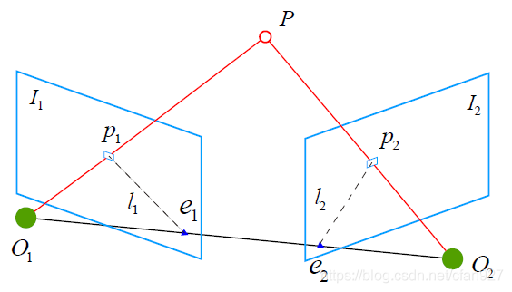
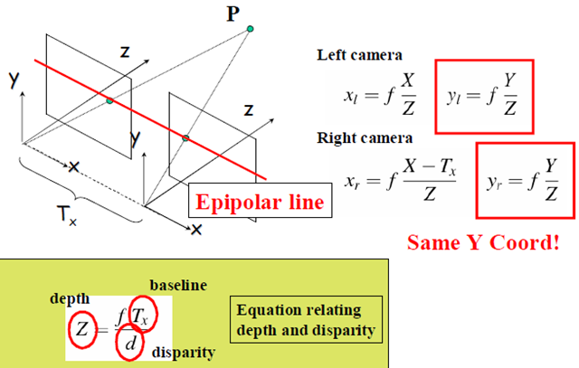
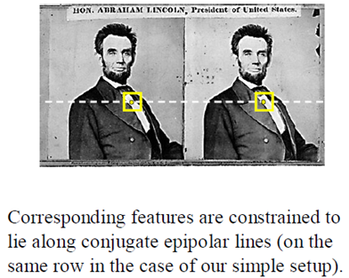
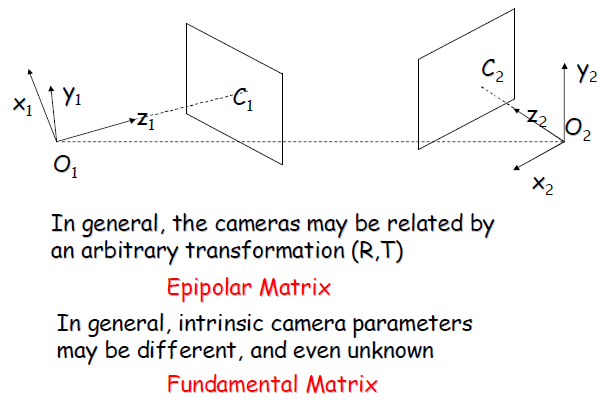
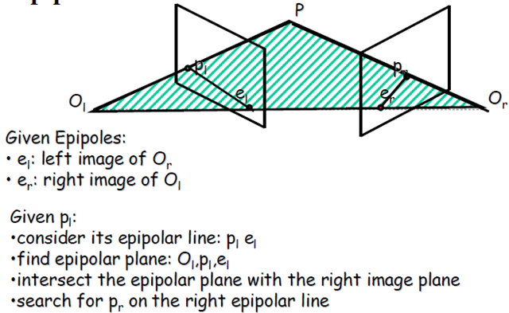
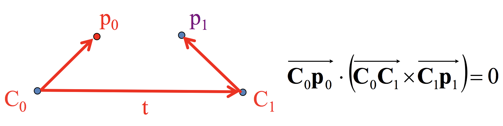
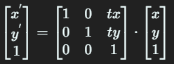
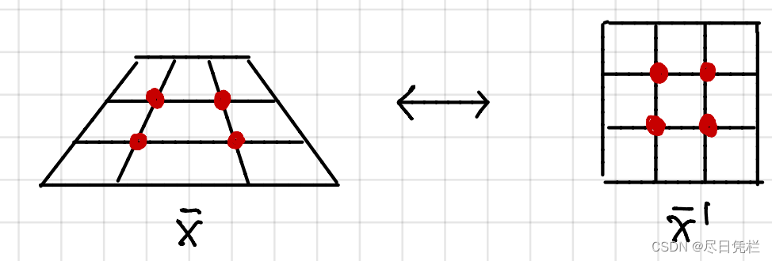

# 摘要

双目标定的目标是获得左右两个相机的内参、外参和畸变系数，其中内参包括左右相机的fx，fy，cx，cy，外参包括左相机相对于右相机的旋转矩阵和平移向量，畸变系数包括径向畸变系数（k1， k2，k3）和切向畸变系数（p1，p2）。

双目相机标定主要的就是为了确定左右相机的内参和两个相机之间的旋转跟平移矩阵，其中matlab的可视化标定工具对双目相机标定入门选手比较友好，本文主要介绍目前可以使用的双目标定工具及双目标定原理。


- [x] Edit By Porter, 积水成渊,蛟龙生焉。 

<!-- more -->

# 1. 双目相机标定方法介绍

目前可以实现相机标定的方法有很多，比如常见的matlab自带相机标定工具箱，可以实现单目相机、双目相机标定例如 

- [Matlab工具箱标定双目相机](https://blog.csdn.net/weixin_46133643/article/details/123897977)
- [手把手教双目相机标定（超详细，附代码）](https://blog.csdn.net/weixin_43535573/article/details/88869054)


[halcon 双目相机标定程序demo](https://www.cnblogs.com/pc7275/p/13261780.html)Halcon自带的双目相机标定程序在binocular_calibration.hdev


- [ros 自带的标定工具](http://wiki.ros.org/camera_calibration/Tutorials/StereoCalibration)\


```bash
rosdep install camera_calibration
```


# 2. 双目标定原理

双目视觉标定就是求解三维空间中坐标点和摄像机二维图像坐标点的对应关系，在双目视觉中，三维空间坐标系一般是以 **左相机** 坐标系作为基准坐标系。利用棋盘板获取到的用于计算的二维图像坐标和三维空间的物理坐标，再通过一定的算法，求解出变换矩阵，则解决了基础的双目视觉标定的过程。

## 2.1 基本术语



首先看一个理想情况（无噪声）。如图所示为两帧图像 $I_{1}, I_{2}$ 在三维空间中的几何关系，相机光心为 $O_{1}, O_{2}$ ，相机由 $O_{1}$ 运动到 $O_{2}$ 位置的变换为 $R$（旋转）和 $T$（平移）。$P$ 为三维空间中的一个点，它在两像平面上的投影为 $p_{1}, p_{2}$，则有以下几个术语来描述它们之间的几何关系：

极平面（Epipolar plane）： 点 $O_{1}, O_{2}, P$ 三点确定的平面；

极点（Epipoles）： $O_{1}, O_{2}$ 连线与像平面 $I_{1}, I_{2}$ 的交点 $e_{1}, e_{2}$ ；

基线（Baseline）： $O_{1}, O_{2}$ 连线；

极线（Epipolar line）： 极平面与两像平面的交线 $l_{1}, l_{2}$ 。

线约束：两极线上点的对应关系.

## 2.2 对极几何(Epipolar Geometry) [ $^{[7]}$ ](https://www.cnblogs.com/gemstone/articles/2294551.html)

先思考一个问题：用两个相机在不同的位置拍摄同一物体，如果两张照片中的景物有重叠的部分，我们有理由相信，这两张照片之间存在一定的对应关系，本节的任务就是如何描述它们之间的对应关系，描述工具是 **对极几何** ，它是研究立体视觉的重要数学方法。

要寻找两幅图像之间的对应关系，最直接的方法就是逐点匹配，如果加以一定的约束条件对极约束(epipolar constraint)，搜索的范围可以大大减小。

先回顾简单的立体成像系统



对极约束的图示



更一般的立体成像关系：两个相机的坐标无任何约束关系，相机的内部参数可能不同，甚至是未知的。要刻画这种情况下的两幅图像之间的对应关系，需要引入两个重要的概念——对极矩阵(Epipolar Matrix)和基本矩阵(Fundamental Matrix)。




## 2.3 对极约束（Epipolar constraint）[ $^{[6.]}$ ](https://blog.csdn.net/cfan927/article/details/106748604)



对极几何图上来，通过上面几幅图示，利用对极几何的约束关系，我们可以：

1. 找到物点P在左像平面上的像点 $p_{l}$ ；

2. 画出极线 $p_{l}-e_{l}$；

3. 找到极平面 $O_{l}-p_{l}-e_{l}$ 与右像平面的交线，即得极线 $p_{r}-e_{r}$ ；

4. 像点 $p_{l}$ 的对应点一定在极线  $p_{r}-e_{r}$ 上。


## 2.4 本质矩阵或本征矩阵E(Essentical Matrix)[ $^{[9.]}$ ](https://www.cnblogs.com/fuzhuoxin/p/12677986.html)：

包含了关于物理空间中两个摄像头的平移和旋转信息，在坐标系中第二个摄像头相对于第一个摄像头的位置。



注意叉乘和点乘，上式 $C_{0}C_{1} \times C_{1}P_{1}$ 是叉乘，结果向量方向垂直 $C_{0}-C_{1}-P_{1}$ 平面。

最左边向量C0-p0就可以用p0表示，向量C0-C1就是光心C1相对于C0的平移，我们记为t， 向量C1-p1根据前面的讨论，可以用 Rp1 来表示，那么结论1可以表示为以下的结论2：

$$
P_{0} \cdot (t \times RP_{1}) = 0
$$

这个式子是根据对极几何得到的，我们称之为 **对极约束**。

$$
E = t \times R
$$

于是我们可以得到如下结论

$$
P_{0} \cdot E \cdot P_{1} = 0
$$


## 2.5 基本矩阵F（Fundamental Matrix）[ $^{[6.]}$ ](https://blog.csdn.net/cfan927/article/details/106748604) [ $^{[9.]}$ ](https://www.cnblogs.com/fuzhuoxin/p/12677986.html)：

除了包含了E中的相同信息外，还包含了两个摄像头的内参数；将图像坐标系（像素）中一个摄像头的像平面上的点和另一个摄像头的像平面上的点相互关联。

$$
x_{0}=K^{-1}p_{0}
$$

$$
x_{1}=K^{-1}p_{1}
$$

$$
P=[X,Y,Z]^T
$$

$K$为相机内参矩阵

$$
P_{0} \cdot (t \times RP_{1}) = 0
$$

为相机坐标，转换为像素坐标为的本质矩阵就是基本矩阵F:

$$
F=K^{-T} \cdot t \times R K^{-1}
$$


## 2.6 单应矩阵（Homograph Matrix）[ $^{[10.]}$ ](https://blog.csdn.net/liubing8609/article/details/85340015)

### 2.6.1 齐次坐标（Homogeneous Coordinate）

在平移、旋转、缩放、剪切和对称变换中，只有平移变换是一个例外，为了将平移变换也写成线性变换的形式，所以引入了齐次坐标

齐次坐标就是将一个原本是n维的向量或者点扩展成n+1维的向量或者点。

二维空间中的点和向量写成齐次坐标的形式如下

2D point = $(x,y,1)^{T}$

2D vector = $(x,y,0)^{T}$

将上面的平移矩阵写成齐次坐标的形式就是



### 2.6.2 单应矩阵（Homography Matrix）[ $^{[12. ]}$ ](https://blog.csdn.net/T_C_Ko/article/details/128176502)

两个不同视角的图像上的点对的homogeneous coordinate可以用一个射影变换（projective transformation）表述，即：x1 = H*x2

射影变换也叫“单应”--Homography，“Homo”前缀就是same的意思，表示“同”，homography就是用同一个源产生的graphy，中文译过来大概就是“单应”。

单应矩阵（homography matrix）之后就简称H矩阵。



假设我们得到了一组对应点 $X = ( x , y )$ , $X^{'} = ( x^{'}, y^{'})$ 

$$
X^{'} = HX
$$

可以理解为是同一个点在两张照片上的像素坐标，用H矩阵联系起来


# 3. 参考文献

[1. 黑马机器人-双目相机原理](https://robot.czxy.com/docs/camera/chapter03/01-stereo_theory/)

[2. 黑马机器人-相机标定&物体检测](https://robot.czxy.com/docs/camera/)

[3. Opencv——双目标定](https://blog.csdn.net/qq_43587345/article/details/103254371)

[4. 双目三维重建系统(双目标定+立体校正+双目测距+点云显示)Python](https://blog.csdn.net/guyuealian/article/details/121301896?ops_request_misc=%257B%2522request%255Fid%2522%253A%2522167611862616800186548884%2522%252C%2522scm%2522%253A%252220140713.130102334..%2522%257D&request_id=167611862616800186548884&biz_id=0&utm_medium=distribute.pc_search_result.none-task-blog-2~all~top_positive~default-1-121301896-null-null.142^v73^pc_search_v2,201^v4^add_ask,239^v1^control&utm_term=%E5%8F%8C%E7%9B%AE%E6%A0%87%E5%AE%9A&spm=1018.2226.3001.4187)

[5. opencv双目标定+立体校正+立体匹配(源码&讲解)](https://blog.csdn.net/weixin_41405284/article/details/105327694)

[6. 【多视几何】对极几何（Epipolar Geometry）基础及OpenCV实现：对极约束、基础矩阵、本质矩阵和单应矩阵
](https://blog.csdn.net/cfan927/article/details/106748604)

[7. 计算机视觉基础4——对极几何(Epipolar Geometry)](https://www.cnblogs.com/gemstone/articles/2294551.html)

[8. 从零开始一起学习SLAM | 为什么要用齐次坐标？](https://mp.weixin.qq.com/s/0QHxvTcH4H072U64uDK_2A)

[9. 对极约束、本质矩阵(E)、基础矩阵(F)](https://www.cnblogs.com/fuzhuoxin/p/12677986.html)

[10. 单应性矩阵的理解及求解](https://blog.csdn.net/liubing8609/article/details/85340015)

[11. 计算机图形学——2D变换与齐次坐标](https://blog.csdn.net/Master_Cui/article/details/119219517)

[12. Homography matrix（单应矩阵）简介](https://blog.csdn.net/T_C_Ko/article/details/128176502)

[13. latex 在线公式编辑器](https://www.latexlive.com/)