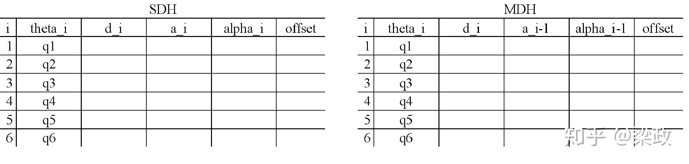

# 摘要

D-H法的简化方式很明确，就是将y轴位移和旋转的2个自由度干掉了，仅考虑x和z轴的位移与旋转。这样，6个自由度的位姿变成由4个参数来表示了。其中参数采用关节角（Joint Angle） $\theta$ 、连杆偏移（Link Offset）$d$  、连杆扭转角（Link Twist） $\alpha$  、连杆长度（Link Length） $a$ 共4个参数来表述相邻两个坐标系的关系。

这4个参数可以分为两组。在移动关节下可变参数 $\alpha$ 是关节参数（Joint Variable）（移动关节的话，可变参数是 $d$ ）。另一组是系统固有参数连杆参数(Link Parameters) $\alpha$  、 $a$ 和 $d$ 。

- [x] Edit By Porter, 积水成渊,蛟龙生焉。 

<!-- more -->

## 1. 机械臂DH参数

<iframe height=498 width=100% src="https://zhuanlan.zhihu.com/p/137960186" scrolling="no" border="0" frameborder="no" framespacing="0" allowfullscreen="true"> </iframe>

## 参考文献

[机器人工程师进阶之路（二）6轴机械臂D-H法建模](https://zhuanlan.zhihu.com/p/137960186)