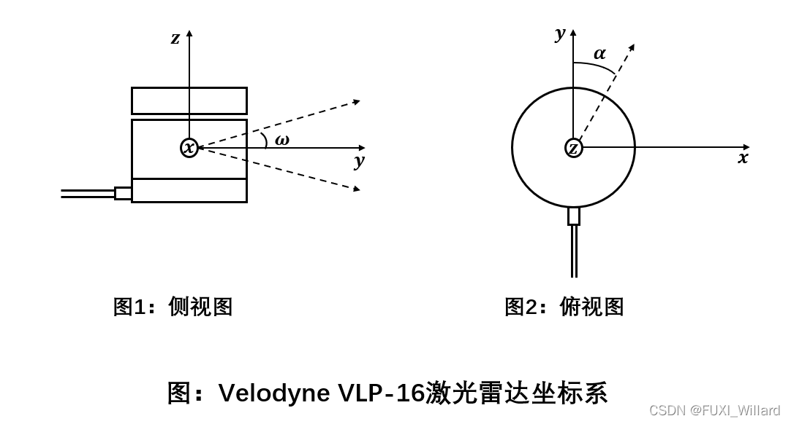
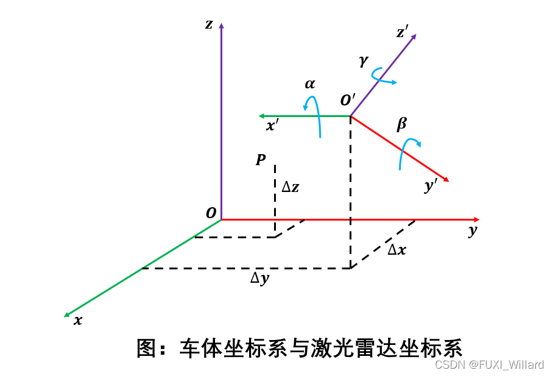

# 引言

- 激光雷达内参标定：内部激光发射器坐标系与雷达本身坐标系的转换关系，在出厂前已经标定完成，可以直接使用；
- 自动驾驶系统需要进行外参标定，即激光雷达自身坐标系与车体坐标系的关系；
- 激光雷达与车体为刚性连接，两者间的相对姿态和位移固定不变；为建立激光雷达之间及激光雷达与车辆之间的相对坐标关系，需要对激光雷达的安装进行标定，并使激光雷达数据从激光雷达坐标系转换至车体坐标系上；

- [x] Edit By Porter, 积水成渊,蛟龙生焉。 

<!-- more -->

- Velodyne VLP-16激光雷达例子：该激光雷达以正上方为z轴，电缆线接口方向为y轴的负方向，通过右手法则确定x轴方向；

本节参考博文 “学习笔记7--激光雷达标定” [ $^{1.}$ ](https://blog.csdn.net/qq_39032096/article/details/121732173)

具体内容可以参考文献 

# 参考文献

[1. 学习笔记7--激光雷达标定](https://blog.csdn.net/qq_39032096/article/details/121732173)

[2. 激光雷达、相机和车体之间的相互标定](https://blog.csdn.net/qq_36076110/article/details/103086064)