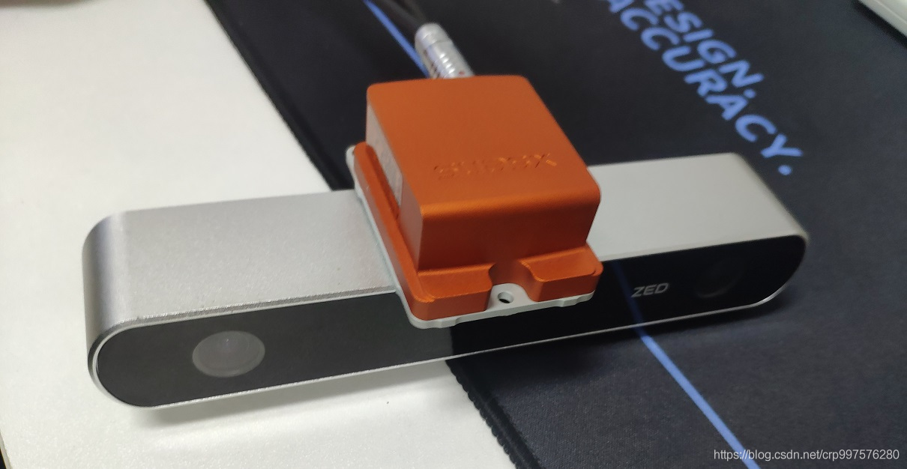
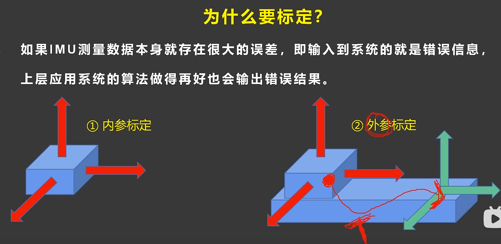
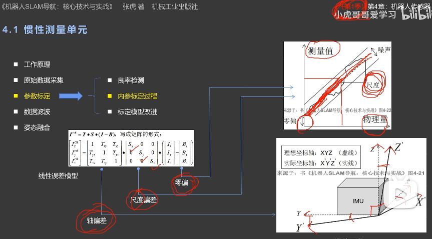
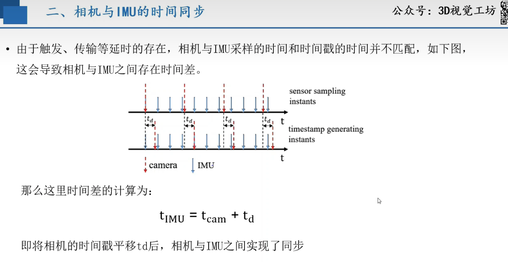
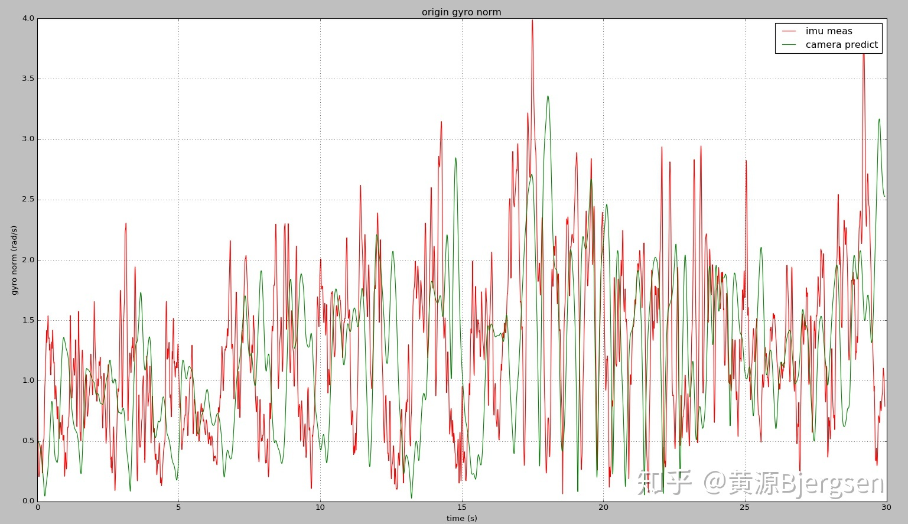
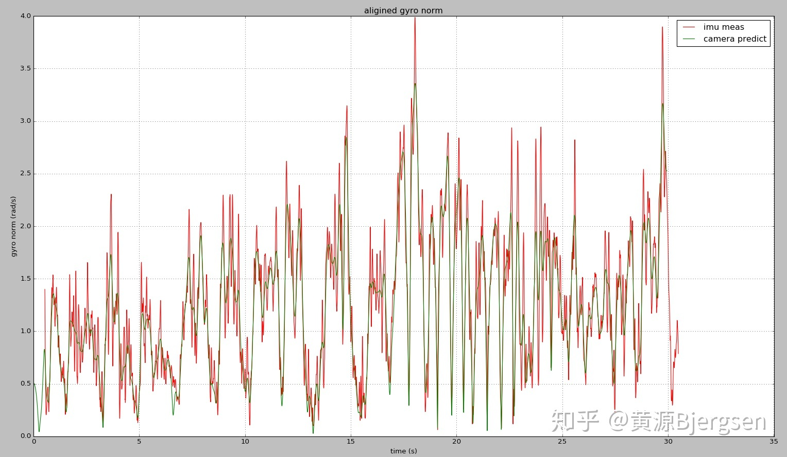
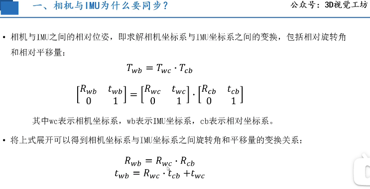

# 摘要（优化中）

在SLAM的众多传感器解决方案中，相机与IMU的融合被认为具有很大的潜力实现低成本且高精度的定位与建图。这是因为这两个传感器之间具有互补性：相机在快速运动、光照改变等情况下容易失效。而IMU能够高频地获得机器人内部的运动信息，并且不受周围环境的影响，从而弥补相机的不足；同时，相机能够获得丰富的环境信息，通过视觉匹配完成回环检测与回环校正，从而有效地修正IMU的累计漂移误差。

相机与IMU之间的外参包括两部分：

- 相机与IMU之间的相对位姿

如下图所示，相机与IMU之间的相对位姿值的是相机坐标系和IMU坐标系之间的变换，包括相对旋转角和相对平移量。

- 相机与IMU之间的时间差

由于触发延时、传输延时的存在，传感器的采样时间和时间戳的时间不匹配，如下图所示，从而导致相机和IMU之间存在时间差td。

- [x] Edit By Porter, 积水成渊,蛟龙生焉。 

<!-- more -->

# 方法

## 标定工具介绍

由于VIO中，普遍使用的是精度较低的imu，所以其需要一个较为准确的内参数和noise的估计。Noise大家通常使用Allan方差进行估计可以得到较为可信的结果。

### ros 里做标定的功能包有 [ $^{[2. ]}$](https://blog.csdn.net/crp997576280/article/details/109592631)

1、 imu_utils标定IMU的内参，可以校准IMU的噪声密度和随机游走噪声

2、kalibr包标定相机的内外参数，相机与IMU之间的外参

3、 IMU内参标定工具imu_tk

[IMU内参标定工具imu_tk](https://github.com/Kyle-ak/imu_tk)

https://github.com/Kyle-ak/imu_tk（或者https://bitbucket.org/alberto_pretto/imu_tk）

## imu误差模型及校准理论参考

如果IMU测量数据本身存在很大的误差，上层应用做的算法再好，到时候都是有误差的。这就需要做一个标定的工作，来矫正敏感的误差，一种是内参标定和外参标定。

内参是相对imu内部来说的，系统内部产生的误差消除掉。

外参标定是相对内参标定来说的。

[IMU误差模型与校准](https://www.cnblogs.com/buxiaoyi/p/7541974.html)

[IMU标定算法流程](https://blog.csdn.net/haoliliang88/article/details/76737960)，包括标定加速度计和标定陀螺仪。可以参考这个博客  

## 相机和imu 的外参标定理论

### 粗略估计camera与imu之间时间延时 [$^{[5.]}$](https://zhuanlan.zhihu.com/p/68863677)

已知每一帧图像的3D-2D对应，可以算出每一帧camera的pose。用这些离散的pose构造连续的B-spline，就可以获取任意时刻pose。

注意这里对pose参数化采用六维的列向量，分别三维的位移 $t$ 和旋转矢量 $\theta$  。对位移和旋转矢量分别求一阶导、二阶导可以得到速度与加速度：

$v=t^{'}$

$a=t^{''}$

$\omega = J_{r}(\theta)\theta^{'}$

利用camera的样条曲线获取任意时刻camera旋转角速度，而陀螺仪又测量imu的角速度。忽略偏置和噪声影响，两者相差一个旋转，且模长相等：

$\omega_{i}=R_{ic}\omega_{c}$

这样用camera和imu测量出来角速度随时间原始曲线：

现在利用两个曲线的相关性，可以粗略估计imu和camera时间延时：

$step = argmax_{k} \sum_{i}a_{i}*v_{i+k}$

现在利用两个曲线的相关性，可以粗略估计imu和camera时间延时：

可以看到利用相关性，可以把时间延时误差缩小到1-2个imu周期范围内。

### 相机和imu的位姿同步(空间同步)

<iframe src="//player.bilibili.com/player.html?aid=848138670&bvid=BV18L4y18733&cid=412299576&page=1" scrolling="no" border="0" frameborder="no" framespacing="0" allowfullscreen="true"> </iframe>

# 参考文献

[1. 解放双手——相机与IMU外参的在线标定](https://www.cnblogs.com/CV-life/p/11160521.html)

[2. 相机与IMU联合标定](https://blog.csdn.net/crp997576280/article/details/109592631)

[3. Kalibr: Multi-Camera Calibration、Visual-Inertial Calibration (CAM-IMU)、Multi-Inertial Calibration (IMU-IMU)、Rolling Shutter Camera Calibration ](https://github.com/ethz-asl/kalibr)

[4. IMU误差模型与校准](https://www.cnblogs.com/buxiaoyi/p/7541974.html)

[5. camera-imu内外参标定](https://zhuanlan.zhihu.com/p/68863677)

<iframe src="//player.bilibili.com/player.html?aid=795841344&bvid=BV1rC4y1p7ma&cid=196331738&page=1" scrolling="no" border="0" frameborder="no" framespacing="0" allowfullscreen="true"> </iframe>
