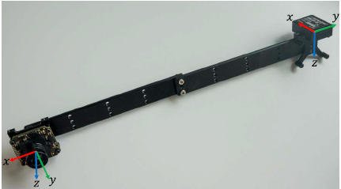
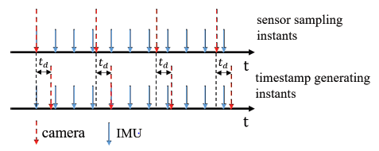

# 摘要

在SLAM的众多传感器解决方案中，相机与IMU的融合被认为具有很大的潜力实现低成本且高精度的定位与建图。这是因为这两个传感器之间具有互补性：相机在快速运动、光照改变等情况下容易失效。而IMU能够高频地获得机器人内部的运动信息，并且不受周围环境的影响，从而弥补相机的不足；同时，相机能够获得丰富的环境信息，通过视觉匹配完成回环检测与回环校正，从而有效地修正IMU的累计漂移误差。

相机与IMU之间的外参包括两部分：

- 相机与IMU之间的相对位姿

如下图所示，相机与IMU之间的相对位姿值的是相机坐标系和IMU坐标系之间的变换，包括相对旋转角和相对平移量。

- 相机与IMU之间的时间差

由于触发延时、传输延时的存在，传感器的采样时间和时间戳的时间不匹配，如下图所示，从而导致相机和IMU之间存在时间差td。

- [x] Edit By Porter, 积水成渊,蛟龙生焉。 

<!-- more -->

# 1. 

# 参考文献

[1. 解放双手——相机与IMU外参的在线标定](https://www.cnblogs.com/CV-life/p/11160521.html)

[2. 相机与IMU联合标定](https://blog.csdn.net/crp997576280/article/details/109592631)

