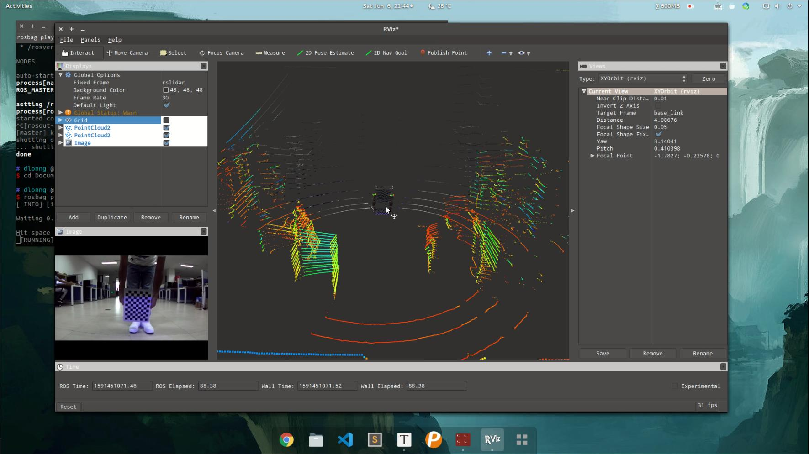

# 引言

单一传感器不可避免的存在局限性，为了提高系统的稳健性，多采取多传感器融合的方案，融合又包含不同传感器的时间同步和空间同步 [ $^{[1.]}$ ](https://blog.csdn.net/learning_tortosie/article/details/82347694) 。

激光雷达和相机的联合标定就属于空间同步范畴。

目前做相机和激光雷达的标定工具有很多，例如：[开源无人驾驶软件Autoware](https://github.com/autowarefoundation/autoware)，[apollo](https://www.apollo.auto/)，lidar_camera_calibration, but_velodyne

还有[calibration_camera_lidar](https://github.com/XidianLemon/calibration_camera_lidar) calibration_camera_lidar，从autoware分离出来的相机雷达联合标定ros包。

激光雷达和相机联合标定还需要对相机进行标定，比如常见的棋盘格[ $^{[2.]}$ ](https://markhedleyjones.com/projects/calibration-checkerboard-collection)相机内外参标定。

- [x] Edit By Porter, 积水成渊,蛟龙生焉。 

<!-- more -->

## 1. 单目相机和激光雷达联合标定工具介绍

- [1.1 livox_camera_lidar_calibration_modified](https://github.com/Shelfcol/livox_camera_lidar_calibration_modified/blob/master/doc_resources/README_cn.md)

livox_camera_lidar_calibration_modified 方案提供了一个手动校准Livox雷达和相机之间外参的方法，已经在Mid-40，Horizon和Tele-15上进行了验证。其中包含了计算相机内参，获得标定数据，优化计算外参和雷达相机融合应用相关的代码。本方案中使用了标定板角点作为标定目标物，由于Livox雷达非重复性扫描的特点，点云的密度较大，比较易于找到雷达点云中角点的准确位置。相机雷达的标定和融合也可以得到不错的结果。


- [1.2 Autoware 标定工具 Calibration Tool Kit 联合标定](https://www.freesion.com/article/75521014295/)标定方法见："无人驾驶汽车系统入门（二十二）——使用Autoware实践激光雷达与摄像机组合标定" [$^{[3. ]}$](https://blog.csdn.net/AdamShan/article/details/81670732)

确定举标定板人的站位及动作：标定板在摄像头下一般有6个站位，每个位置做相同的一组5个动作。5个动作分别为:正向; 下俯; 上仰; 左偏; 右偏。如下图所示：




- calibration_camera_lidar [ $^{[4.]}$ ](https://blog.csdn.net/qq_21751281/article/details/128929580) 

相机内参标定:

```bash
rosrun camera_calibration cameracalibrator.py --size 8x6 --square 0.112 image:=/camera/image
```

相机-激光雷达联合标定:

```bash
rosrun calibration_camera_lidar calibration_toolkit
```

- 1.3 appollo 标定[ $^{[5.]}$ ](https://blog.csdn.net/m0_38087936/article/details/88536345)

Apollo传感器标定服务和三种标定工具：

◆ Camera-to-Camera Calibration（相机到相机的标定）

◆ Camera-to-LiDAR Calibration（相机到激光雷达的标定）

◆ Radar-to-Camera Calibration（雷达到相机的标定）

◆ IMU到汽车的标定​​

```bashr
cd /apollo
bash scripts/sensor_calibration.sh imu_vehicle
```

```bash
cd /apollo/scripts
bash sensor_calibration.sh radar_camera
```


注：Apollo中，新的标定工具（Camera-to-Camera Calibration, Camera-to-LiDAR Calibration, and Radar-to-Camera Calibration)将以板载可执行程序的方式提供。关于LiDAR-GNSS 标定，请参考LiDAR-IMU calibration guide。Velodyne HDL-64 的用户仍可使用Apollo中的标定服务。使用这些标定工具可以极大的减少用户的工作量。我们只需要启动相应的标定程序，即可快速的完成标定任务。此外，用户还可对以.yaml文件格式保存的标定结果进行验证。

## 2 激光雷达与相机标定原理 [$^{[7.]}$](https://blog.csdn.net/qq_39032096/article/details/121732173)

| 单目相机      | 激光雷达 |
| ----------- | ----------- |
| 分辨率高      | 精确的三维坐标信息|
| 深度学习算法   | 激光线稀疏        |
|缺乏深度，坐标信息等| 分辨率低|

激光雷达与摄像机的联合标定，就是通过提取标定物在单线激光雷达和图像上的对应特征点，完成单线激光雷达坐标、摄像机坐标、图像像素等多个传感器的统一，实现激光雷达与摄像机的空间校准 [$^{[6.]}$](https://wenku.baidu.com/view/62445e50c6da50e2524de518964bcf84b9d52d31.html?_wkts_=1676620386225&bdQuery=%E7%9B%B8%E6%9C%BA%E5%88%B0%E6%BF%80%E5%85%89%E9%9B%B7%E8%BE%BE%E6%A0%87%E5%AE%9A%E5%8E%9F%E7%90%86)。

- 自动驾驶车辆上，激光雷达与车体为刚性连接，两者间的相对姿态和位移固定不变，激光雷达扫描获得的数据点，在环境坐标系中有唯一的位置坐标与之对应；

- 摄像机在环境坐标系中也有唯一的位置坐标，激光雷达与摄像机之间存在固定的坐标转换；

- 激光雷达与摄像机的联合标定，通过提取标定物在单线激光雷达和图像上的对应特征点，完成单线激光雷达坐标、摄像机坐标、图像像素坐标等多个传感器坐标的统一，实现激光雷达与摄像机的空间校准；

- 当摄像机与激光雷达同时观察点 $P$ 时，点 $P$ 在摄像机自身环境坐标系中的坐标为 $P_{vc}(x_{vc}, y_{vc}, z_{vc})$ ，在摄像机图像的图像像素坐标系下的投影坐标为 $U=(u,v,1)^{T}P_{1}(x_{1},y_{1},z_{1})$;

- 设激光雷达-摄像机的转换关系为 $[R^{*}|T^{*}]$ , ，则激光点云中的扫描点  $(x_{1}, y_{1}, z_{1})$ ,在图像像素坐标系中的坐标 $(u, v)$ ,通过以下公式计算：

$
\begin{pmatrix}
 u\\
 v\\
1
\end{pmatrix}
=K(R*\begin{pmatrix}
x \\
y \\
z
\end{pmatrix}
+T^{*})
$

其中，

$
K=\begin{pmatrix}
f_{x}  & 0 & u_{0}\\
0  &  f_{y}& v_{0} \\
0  &  0& 1
\end{pmatrix}
$ , 为相机内参矩阵。

对上式进行变换，可得：

$
R*\begin{pmatrix}
x \\
y \\
z
\end{pmatrix}
+T^{*}
=K^{-1}\begin{pmatrix}
u \\
v \\
1
\end{pmatrix}
$

激光雷达与摄像机的标定，即求解上式的 [$R^{*}|T^{*}$]
,  [$R^{*}|T^{*}$]共有12个参数需要求解，理论上需要至少4组激光雷达的对应点求解，为了提高精度，标定过程一般使对应点的数量n>4，使用最下二乘法进行求解；

# 参考文献

[1. 激光雷达和相机的联合标定（Camera-LiDAR Calibration）之Autoware](https://blog.csdn.net/learning_tortosie/article/details/82347694)

[2. 在线生成棋盘格calibration-checkerboard-collection](https://markhedleyjones.com/projects/calibration-checkerboard-collection)

[3. 无人驾驶汽车系统入门（二十二）——使用Autoware实践激光雷达与摄像机组合标定](https://blog.csdn.net/AdamShan/article/details/81670732)

[4. 相机-激光雷达联合标定方法](https://blog.csdn.net/qq_21751281/article/details/128929580)

[5. 理解Apollo传感器标定文档](https://blog.csdn.net/m0_38087936/article/details/88536345)

[6. 激光雷达与摄像机的标定](https://wenku.baidu.com/view/62445e50c6da50e2524de518964bcf84b9d52d31.html?_wkts_=1676620386225&bdQuery=%E7%9B%B8%E6%9C%BA%E5%88%B0%E6%BF%80%E5%85%89%E9%9B%B7%E8%BE%BE%E6%A0%87%E5%AE%9A%E5%8E%9F%E7%90%86)

[7. 学习笔记7--激光雷达标定](https://blog.csdn.net/qq_39032096/article/details/121732173)

<iframe src="//player.bilibili.com/player.html?aid=429732540&bvid=BV17G41147N7&cid=807641142&page=1" scrolling="no" border="0" frameborder="no" framespacing="0" allowfullscreen="true"> </iframe>