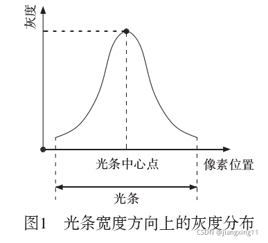

# 摘要

Halcon中的lines_gauss采用的是steger算法，Steger算法基于Hessian矩阵，能够实现线条中心亚像素精度定位。

高斯线提取算法流程及基础

1. 高斯模糊滤波；
2. 粗定位线条位置，减少运算量；
3. Hessian矩阵计算特征值检测线条法线方向；
4. 定位线条的亚像素坐标；

<!-- more -->

# 算法背景

在线结构光视觉传感器中，由线激光器发射出的线结构光，在本质上为一个连续且具有一定厚度的空间光平面，而在目标表面上所形成的具有一定宽度的光条特征，即为该光平面与目标表面相交而成的交线。

在该空间光平面的厚度方向上，光强近似服从高斯分布，因而在摄像机采集到的光条图像中，在沿着光条宽度的方向或光条的法线方向上，其灰度也会呈现出类似的高斯分布特点，即光条中心的灰度值大而光条边缘的灰度值小，如图1所示，因而光条中心线的提取任务就是要找到图像中的光条灰度的高斯分布中心。

如果熟悉Halcon软件的朋友应该对Line_Gauss算法非常了解，该算法的核心其实就是德国 Steger 博士最先 **提出的基于 Hessian 矩阵的亚像素级光条中心线的提取方法** 。

Steger算法的基本思路是首先通过 Hessian 矩阵获得光条的法线方向，然后在其法线方向上对像素灰度应用泰勒多项式展开而得到灰度分布函数，进而计算出光条中心的亚像素位置。由于光条特征的灰度在其法线方向上近似为高斯分布，因而越靠近光条中心点的像素，其灰度值越大。因此，对该法线方向上的灰度分布函数的二阶泰勒多项式求取极值，即可得到光条在该法线方向上的中心点坐标。

# 海森矩阵

$
H(f)=\begin{bmatrix}
  \frac{\partial^2f}{\partial x_1^{2}}   & \frac{\partial^2f}{\partial x_1 \partial x_2} & ... & \frac{\partial^2f}{\partial x_1 \partial x_n}\\
  \frac{\partial^2f}{\partial x_{2} \partial x_1} & \frac{\partial^2f}{\partial x_{2}^{2}} &...& \frac{\partial^2f}{\partial x_2 \partial x_n}\\
  ...&  ...&  ...& ...\\
  \frac{\partial^2f}{\partial x_{n} \partial x_1} & \frac{\partial^2f}{\partial x_{n} \partial x_{2}} &...& \frac{\partial^2f}{\partial x_n \partial x_n}
\end{bmatrix}
$

对于二维离散图像I(u, v) 来说，其 Hessian 矩阵可以表示为

$
H(u,v)=\begin{bmatrix}
 I_{uu} & I_{uv}\\
 I_{uv} & T_{vv}
\end{bmatrix}
$

其中，u、v 分别表示像素的列坐标和行坐标；
I(u, v)即为像素 (u, v) 的灰度，因而可以将I(u, v) 视为该图像的灰度分布函数；Iuu、Iuv和Ivv分别表示二维高斯函数G(u, v)的二阶偏导数与图像I(u, v) 进行卷积运算的结果。

一元函数在点$$x_{k}$$ 处的泰勒展开式为：

$f(x)=f(x_{k})+(x-x_{K})f'(x_{k}) +\frac{1}{2!} (x-x_{k})^{2})f''(x_{k})+o^{n}$

二元函数在点$$
( x_{k} , y_{k} )$$处的泰勒展开式为：

$f(x,y)=f(x_{k},y_{k})+(x-x_{K})f_{x}'(x_{k},y_{k}) +(y-y_{K})f_{y}'(x_{k},y_{k}) +\frac{1}{2!} (x-x_{k})^{2})f_{xx}''(x_{k},y_{k})
+\frac{1}{2!} (y-y_{k})^{2})f_{yy}''(x_{k},y_{k})
+\frac{1}{2!} (x-x_{k})(y-y_{k}))f_{xy}''(x_{k},y_{k})
++\frac{1}{2!} (x-x_{k})(y-y_{k}))f_{yx}''(x_{k},y_{k})
+o^{n}$

把泰勒展开式写成矩阵的形式，如下图所示，其中的$H ( x_{k} )$ 就是我们上面提到的Hessian矩阵（二阶导数），至此，泰勒展开与Hessian矩阵的联系就描述完成，注意其中的X，它是向量形式。

$$f(x)=f(x_{k})+[\nabla{f(x_{k})}]^{T} (x-x_{K})
+ \frac{1}{2!} [(x-x_{k})]^{T}H(x_{k})[x-x_{k}]+o^{n}$$

其中，

$$
H(x_{k})=\begin{bmatrix}
  \frac{\partial^2f(x_{k})}{\partial x_1^{2}}   & \frac{\partial^2f(x_{k})}{\partial x_1 \partial x_2} & ... & \frac{\partial^2f(x_{k})}{\partial x_1 \partial x_n}\\
  \frac{\partial^2f(x_{k})}{\partial x_{2} \partial x_1} & \frac{\partial^2f(x_{k})}{\partial x_{2}^{2}} &...& \frac{\partial^2f(x_{k})}{\partial x_2 \partial x_n}\\
  ...&  ...&  ...& ...\\
  \frac{\partial^2f(x_{k})}{\partial x_{n} \partial x_1} & \frac{\partial^2f(x_{k})}{\partial x_{n} \partial x_{2}} &...& \frac{\partial^2f(x_{k})}{\partial x_n \partial x_n}
\end{bmatrix}
$$

为海森矩阵的表示方式。

## Steger算法提取激光线原理

Steger算法基于Hessian矩阵，能够实现光条中心亚像素精度定位：首先通过Hessian矩阵能够得到光条的法线方向，然后在法线方向利用泰勒展开得到亚像素位置。

对于图像中激光条纹上的任意一点(x,y)，Hessian矩阵可以表示为：

$$
H(x,y)=\begin{bmatrix}
  r_{xx}&r_{xy} \\
  r_{xy}&r_{yy}
\end{bmatrix}
$$

其中 $r_{xx}$ 表示图像沿x的二阶偏导数，其他参数类似。需要注意的是在求Hessian矩阵之前需要对图像进行高斯滤波，高斯滤波时，根据文献中[《具体参考我的飞书笔记》](https://s31nliblzt.feishu.cn/wiki/wikcn9k8WTCovr1va5CgDp4PfLf)，设置高斯方差$
σ<\frac{w}{\sqrt 3}$ ,其中w为光条宽度，Hessian矩阵最大特征值对应的特征向量对应于光条的法线方向，用 $
(n_{x},n_{y})$ 表示，以点 $
(x_{0},y_{0})$ 为基准点，则光条中心的亚像素坐标为：

$$(p_{x},p_{y})=(x_{0}+tn_{x}，y_{0}+tn_{y})$$

$$t=−\frac{n_{x}r_{x}+n_{y}r_{y}}{n^{2}_{x}r_{xx}+2n_{x}n_{y}r_{xy}+n^{2}_{y}r_{yy}} $$

如果 $(tn_{x},tn_{y})$ ∈[−0.5,0.5]×[−0.5,0.5] ，即一阶导数为零的点位于当前像素内，且 $(n_{x},n_{y}) $ 方向的二阶导数大于指定的阈值，则该点 $(x_{0},y_{0})$ 为光条的中心点，$(p_{x},p_{y}) $ 则为亚像素坐标。

# 3. 参考文献

具体参考我的飞书笔记:

[高斯滤波提取激光笔记](https://s31nliblzt.feishu.cn/wiki/wikcn9k8WTCovr1va5CgDp4PfLf)

